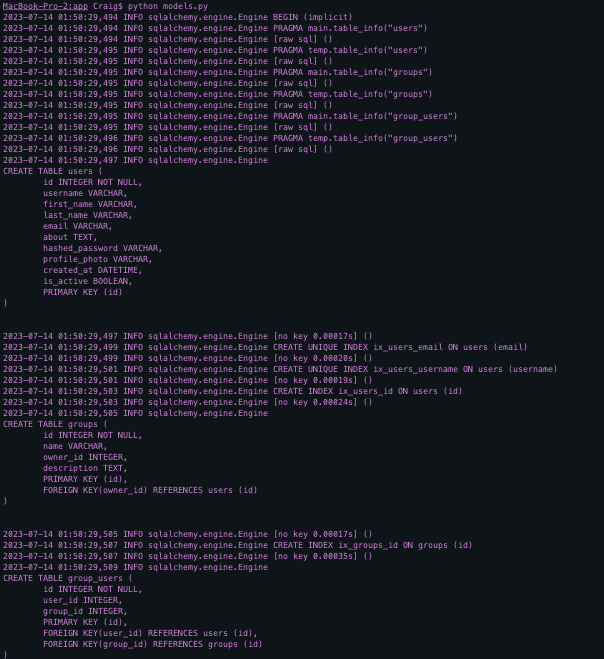
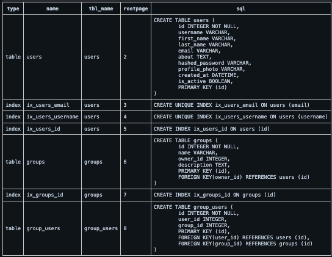
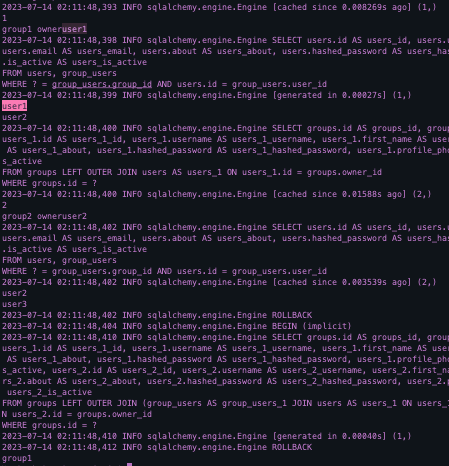
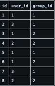
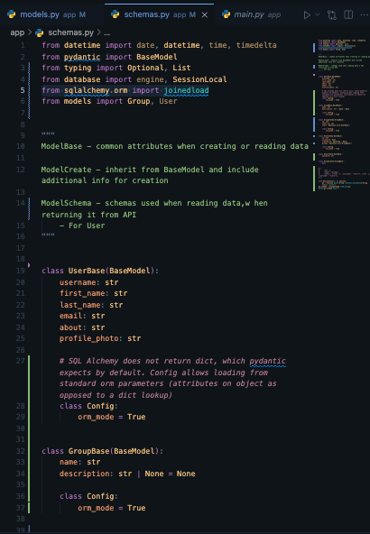

# 07/11/2023
- Looked up start guide on sqlite and fastapi setup
- Main investigation
    - Figure out microservice implementation with sqlite using sqlalchemy, fastapi
    - Can microservice architecture be achieved using sqlite in the first place?
    - Comparing my understanding/guides to my fitster project, signals to me that there were was a serious level of abstraction/files that I am unsure about their inclusion/contribution to db performance/operation
- Agenda
    - Start small for now regarding db steps
        - Set up a db solely for user interaction, tokens and then figure out ms interaction at some point and capabilities within sqlite

# 07/12/2023
- Notes
    - [sql alchemy docs](https:/.sqlalchemy.org/en/20/intro.html)
        - SQLA Toolkit, ORM are set of tools to work on dbs, python (2 significant portions: ORM + Core)
            - Core containing SQL expression language indep of ORM package providing a system of constructing sql expressions to be executed against a target db in scope of transaction returning a result set
            - inserts, updates, deletes (dml) are performed using sql expression objects rep statements with dicts rep parameters to be used
            - ORM = object relational mapping abilities (provides additional config layer allowing user-defined python classes to be mapped to db tables and other constructs in addition to object persistence mechanism = Session)
        - (1) Ran  `pip install SQLAlchemy` -> `pip show sqlalchemy` to verify
            ```
            Name: SQLAlchemy
            Version: 2.0.18
            Summary: Database Abstraction Library
            Home-page: https://www.sqlalchemy.org
            Author: Mike Bayer
            Author-email: mike_mp@zzzcomputing.com
            License: MIT
            Location: /Users/Craig/.pyenv/versions/3.10.2/lib/python3.10/site-packages
            Requires: greenlet, typing-extensions
            Required-by:
            ```
        - Performed setup regarding SQL connection and Tables
            - Ran into problem of profile photo
                * After doing some research, found these excerpts
                ```
                It would probably be a better idea to get a pre-signed URL from S3 and let the client POST directly to the storage bucket.

                The way we do this is to generate a pre-signed S3 url in the backend. The client can request one and it's valid for a few mins. You could set this up with an AWS Lamba endpoint probably.
                ```
                - Will have to use S3-Svelte Guide
                    * [Svelte-S3 Uploading](https://rodneylab.com/sveltekit-s3-compatible-storage/)
                    - as they are urls, profile photo will have to be a string, as it will be a pre-signed url in the BE

                - When t3-dude does provide more frameworks for implementation
                    - [UploadThing](https:/.uploadthing.com/solid)
                    - Simpler alternative

            - For auth, I am going to attempt Cerbos (at some point in this demo)
                - Docs recommended OAuth2, so still need to decide between how exactly this process will be finalized or if there tradeoffs between the two

            - Models Setup
                - [Implementing Back_Populates](https://stackoverflow.com/questions/39869793/when-do-i-need-to-use-sqlalchemy-back-populates)
                    - 
                - [Many To Many Relationship](https://stackoverflow.com/questions/5756559/how-to-build-many-to-many-relations-using-sqlalchemy-a-good-example)

            - Pydantic: BaseModel
                - Pydantic also uses the term "model" to refer to something different, the data validation, conversion, and documentation classes and instances.
                - Aka models need to be defined twice, for sql data entry then conversion of sql tables to api 'converted' data

# 07/13/2023
- Most likely am going to have use Docker for Cerbos, LocalStack
    - [Cerbos](https://github.com/cerbos/python-sqlalchemy-cerbos/tree/main)
    - [Local Stack](https://github.com/localstack/localstack#example)

- Many to Many Pydantic Model, SQLite
    - [Many2Many](https://www.gormanalysis.com/blog/many-to-many-relationships-in-fastapi/)

- [X] Successful Table Test - with Dummy Data

    - process to see testing live
        - cd into app -> run `python schemas.py` (thats it for now, creates a db and pycache file)
            - illustrates proper data entry for models, pydantic using sql alchemy
        - after running `python schemas.py` to test differently, make sure to delete pycache folder as well as sql_app.db as u will get key constraints as data has to be unique :)

    - __RESULTS__
    - the command `python schemas.py` executes the 'fastapi script' of models, schemas that results in an instance of sqlite db being generates
    - if one does not have the sqlite explorer extension, download it to view generated sqlite db
        - 
    - if sqlite explorer is installed(?), then u can view tables
        - 
        - 
        - 
            - 
            - 
            - 


- Worked on Schemas
    - 
        - 

* Agenda
    - Need to work on Crud, Main.py in order to get FastApi docs operational!
    - Need to get to localhost stage
