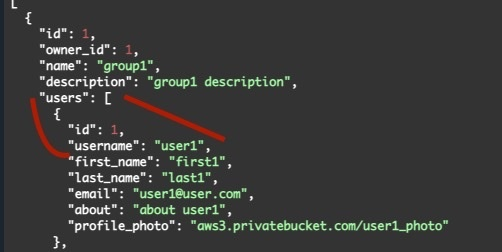

# Outline
- [Jul27th](#july-27th)
- [General Agenda](#week-5-agenda)
- APP CHART
    

## JULY 27TH
> Going to get the ball back rolling and get significant work done
- > Thinking about for the sake of convenience about dropping and adding tables using alembic for migrations
    - In a previous project used a sh script for postgresql in order to have several dbs created
    ```sh
        #!/bin/bash

        set -e
        set -u

        function create_user_and_database() {
            local database=$1
            echo "  Creating user and database '$database'"
            psql -v ON_ERROR_STOP=1 --username "$POSTGRES_USER" <<-EOSQL
                CREATE USER $database WITH LOGIN PASSWORD 'password';
                CREATE DATABASE $database;
                GRANT ALL PRIVILEGES ON DATABASE $database TO $database;
            EOSQL
        }

        if [ -n "$POSTGRES_MULTIPLE_DATABASES" ]; then
            echo "Multiple database creation requested: $POSTGRES_MULTIPLE_DATABASES"
            for db in $(echo $POSTGRES_MULTIPLE_DATABASES | tr ',' ' '); do
                create_user_and_database $db
            done
            echo "Multiple databases created"
        fi
    ```
    - > a script similar could be in the above form, taking into account sqlite
        1. script for sqlite: [SQLite SH](../../relational-data/create-multiple-databases.sh)
        2. alembic ini for each microservice
            -update url to point to corresponding db file
                - example: [users alembic.ini](../../users/alembic.ini)
        3. Ensure each ms has own alembic directory
            - in each perform `alembic init alembic`
                - creates an alembic dir (retitled to alembic_{microservice}) and creates an alembic.ini to inform about where migrations of tables occur
                - example: [users_alembic directory](../../users/alembic_users/) and [users ini](../../users/alembic.ini)
        4. (*sigh*) Will have to use docker with alembic
            - Created a docker-compose.yml
                - [DOCKER YML](../../docker-compose.yml) [ to be completed ]
            - I may have to create dockerfiles for each ms individually (?)
                ```
                You need a Dockerfile.
                Dockerfile defines how to create certain docker image (at low level).
                Docker compose defines how to run, link,configure containers (from images) together
                ```
            - (unrelated) will also have to use docker with cerbos (acls)
        5. [Docs on DB Migration](DatabaseMigrations.md)
        6. Revised [env file](../../users/alembic_users/env.py)
            - to include db parameters
        7. Ran `alembic revision --autogenerate -m "Create tasks table"` in users microservice
        8. successfully created user tables

- > Edit Group Structure
    - For groups, I need to modify the returned structure in order to receive owner username as opposed to id
        - 

- > Need to get progress on ACLS/User roles
    - [Previous Notes](AccessControl.md)
        - I'm going to try this out for an amateur start

-

## WEEK 5 AGENDA
- [BE PDF Diagram](../Images/DataBase%20Wireframe.pdf)
    - which is out of date :3
- Rest of Agenda
    - [ ] FINISH CRUD
        - Users
            - Create Account (soon) -> Login
                - POST /USERS (soon) -> GET /TOKEN
            - Update Account
                - PUT/USER_ID
            - Delete Account
                - DELETE/USER_ID
            - Search for other accounts
                - account username, name (last, first, or  both), email, group
                    - GET /user/{username}
                    -
        - Groups
            - Create Groups
            - Update Groups
            - Delete Groups
            - Search for other Groups
                - Via id, name, event, group owner
    - [ ] TOKEN BE
        - [ ] GET /TOKEN
        - [ ] (Sign Up) Ensure that the password is hashed and that said password is deleted on the FrontEnd ( req password security )
        - [ ] Logged in user can view account details
        - [ ] Logged in user can update account details
        - [ ] Logged in
    - [ ] Establish users are able to log out in mockup
        - DELETE TOKEN (or this might be a process of deleting token on fe?)
    - [ ] Establish users are able to login
        - GET TOKEN
    - [ ] Establish errors are present with invalid account creation, login in mockup
- [ ] Implement Roles with Casbin/FastAPI middleware
    - [ ] Implementation of ACL Middleware/System for roles

- __SKELETON__
- Users:
    - The first step will be the entire user flow
        - 2 paths being: Create Account, Log In
            - Logged out (page that has printed on it 'ur logged out') -> (a) (button 'sign up') Create account -> button directs to a (form page) or (b) (button 'login') Login to prev created account
                - Successful Attempts (status code 500)
                    - (a) user inputs info on form page [ check to make sure there are no duplicate accounts, password is ok, username is okay, email is valid] [POST REQUEST] (500)-> clear form, successful login [GET TOKEN] -> direct to new page (page that has 'ur logged in' with user data on it except password) (cookie/token obtained after logging in) -> (button 'log out') Sign out [DELETE TOKEN] -> Back to start (page that has 'ur logged out' on it)
                        - Login form allows one to input username, email, first name, last name, password, profile photo, about me section {`user.description`}, profile photo (upload profile photo), select interests (drawn from a db that has all potential interests to match to a recommended event/events)
                    - (b) user inputs username and password -> press login button with correct info -> [LOGIN BE to check for correct account info]+[ GET TOKEN ] (500)-> site ('ur logged in' with 'sign out' button) has user data present without password
                        - Means I'm able to pass in user data from be to fe [ token, user data with hashed password, session (cookies) ]
                - Unsuccessful Attempts (status code 400?)
                    - (a) bad create account attempts -> tells user that 'x' is wrong
                        - user inputs data that is present with another user
                            - data that would present errors: same username
                            - tell user that there is an account with same username
                                - different accounts can have same email, first, last name etc. but not same username
                                - searching for accounts (?)
                        - invalid username, invalid first or last, invalid email
                    - (b) bad login attempt -> tell user there is no user with 'x' username, 'y' password
                        - 'user with {x} username not found'
                        - 'password and username combo does not match'
        - View account and details
            - View account role, access privileges
        - View account favorite events and rsvps
        - Update account
            - Update username, email, first name, last name, password, profile photo, about me section , profile photo (upload profile photo), interests

- Notes/Extraneous resources
    - Spatial/Location Info
        - [Using Open Street Map](https://wiki.openstreetmap.org/wiki/Using_OpenStreetMap#Web_applications)
        - [Spatial Data Apis](https://www.reddit.com/r/gis/comments/tb5rcq/what_are_some_of_your_favorite_apis_that_expose/)

- Google Calendar
    - [Python Quick Start](https://developers.google.com/calendar/api/quickstart/python)

    - [Api Key Setup](https://stackoverflow.com/questions/50881005/google-sheet-api-message-the-request-is-missing-a-valid-api-key)

        - Python Example
            - [Google Python Api Gateway](https://github.com/googleapis/python-api-gateway)
                - There is a quick start guide on that page, alot of instruction on implementing it locally !
