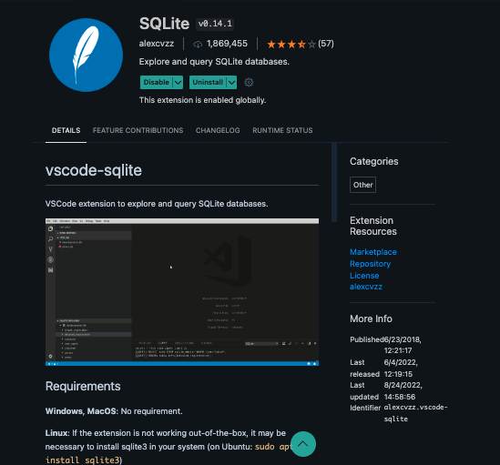
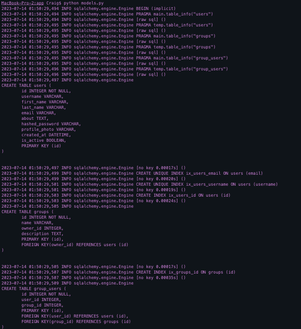
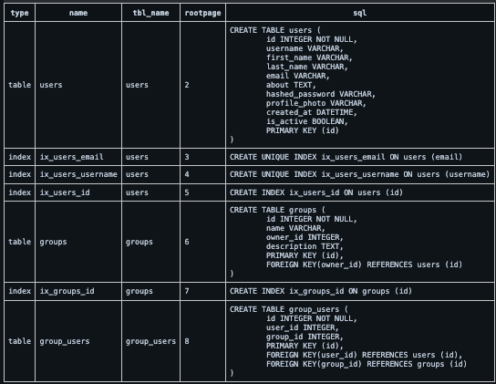
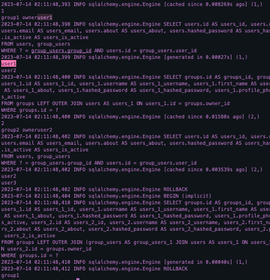
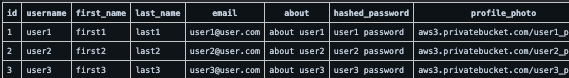
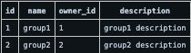
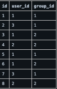
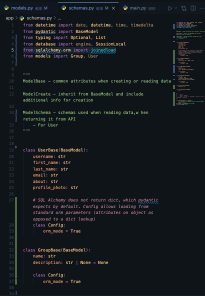
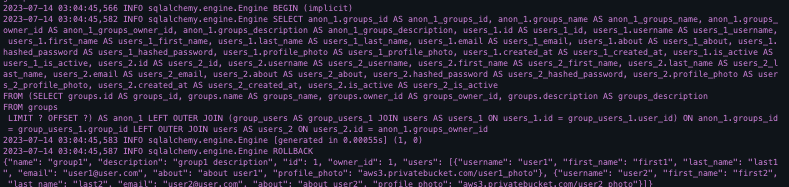

# 07/11/2023
- Looked up start guide on sqlite and fastapi setup
- Main investigation
    - Figure out microservice implementation with sqlite using sqlalchemy, fastapi
    - Can microservice architecture be achieved using sqlite in the first place?
    - Comparing my understanding/guides to my fitster project, signals to me that there were was a serious level of abstraction/files that I am unsure about their inclusion/contribution to db performance/operation
- Agenda
    - Start small for now regarding db steps
        - Set up a db solely for user interaction, tokens and then figure out ms interaction at some point and capabilities within sqlite

# 07/12/2023
- Notes
    - [sql alchemy docs](https:/.sqlalchemy.org/en/20/intro.html)
        - SQLA Toolkit, ORM are set of tools to work on dbs, python (2 significant portions: ORM + Core)
            - Core containing SQL expression language indep of ORM package providing a system of constructing sql expressions to be executed against a target db in scope of transaction returning a result set
            - inserts, updates, deletes (dml) are performed using sql expression objects rep statements with dicts rep parameters to be used
            - ORM = object relational mapping abilities (provides additional config layer allowing user-defined python classes to be mapped to db tables and other constructs in addition to object persistence mechanism = Session)
        - (1) Ran  `pip install SQLAlchemy` -> `pip show sqlalchemy` to verify
            ```
            Name: SQLAlchemy
            Version: 2.0.18
            Summary: Database Abstraction Library
            Home-page: https://www.sqlalchemy.org
            Author: Mike Bayer
            Author-email: mike_mp@zzzcomputing.com
            License: MIT
            Location: /Users/Craig/.pyenv/versions/3.10.2/lib/python3.10/site-packages
            Requires: greenlet, typing-extensions
            Required-by:
            ```
        - Performed setup regarding SQL connection and Tables
            - Ran into problem of profile photo
                * After doing some research, found these excerpts
                ```
                It would probably be a better idea to get a pre-signed URL from S3 and let the client POST directly to the storage bucket.

                The way we do this is to generate a pre-signed S3 url in the backend. The client can request one and it's valid for a few mins. You could set this up with an AWS Lamba endpoint probably.
                ```
                - Will have to use S3-Svelte Guide
                    * [Svelte-S3 Uploading](https://rodneylab.com/sveltekit-s3-compatible-storage/)
                    - as they are urls, profile photo will have to be a string, as it will be a pre-signed url in the BE

                - When t3-dude does provide more frameworks for implementation
                    - [UploadThing](https:/.uploadthing.com/solid)
                    - Simpler alternative

            - For auth, I am going to attempt Cerbos (at some point in this demo)
                - Docs recommended OAuth2, so still need to decide between how exactly this process will be finalized or if there tradeoffs between the two

            - Models Setup
                - [Implementing Back_Populates](https://stackoverflow.com/questions/39869793/when-do-i-need-to-use-sqlalchemy-back-populates)
                    - 
                - [Many To Many Relationship](https://stackoverflow.com/questions/5756559/how-to-build-many-to-many-relations-using-sqlalchemy-a-good-example)

            - Pydantic: BaseModel
                - Pydantic also uses the term "model" to refer to something different, the data validation, conversion, and documentation classes and instances.
                - Aka models need to be defined twice, for sql data entry then conversion of sql tables to api 'converted' data

# 07/13/2023
- Most likely am going to have use Docker for Cerbos, LocalStack
    - [Cerbos](https://github.com/cerbos/python-sqlalchemy-cerbos/tree/main)
    - [Local Stack](https://github.com/localstack/localstack#example)

- Many to Many Pydantic Model, SQLite
    - [Many2Many](https://www.gormanalysis.com/blog/many-to-many-relationships-in-fastapi/)

- [X] Successful Table Test - with Dummy Data

    - process to see testing live
        - cd into app -> run `python schemas.py` (thats it for now, creates a db and pycache file)
            - illustrates proper data entry for models, pydantic using sql alchemy
        - after running `python schemas.py` to test differently, make sure to delete pycache folder as well as sql_app.db as u will get key constraints as data has to be unique :)

    - __RESULTS__
    - the command `python schemas.py` executes the 'fastapi script' of models, schemas that results in an instance of sqlite db being generates
    - if one does not have the sqlite explorer extension, download it to view generated sqlite db
        - 
    - if sqlite explorer is installed(?), then u can view tables
        - 
        - 
        - 
            - 
            - 
            - 


- Worked on Schemas
    - 
        - 

* Agenda
    - Need to work on Crud, Main.py in order to get FastApi docs operational!
    - Need to get to localhost stage

# 07/17/23

- __GENERAL AGENDA__
    - Demo/Sample of BE -> FE functionality
        - User MS
            - First Draft
                - [ ] Establish DB setup for users first
                - [ ] Ensure that user table can be setup with chosen db
                - [ ] (fastapi) Setup queries, routers for users service and ensure there is proper operation with chosen db
                - [ ] Establish the ability to CRUD users (FA docs)
                    - Create Account
                        - POST -> GET TOKEN
                    - Update Account
                        - PUT/USER_ID
                    - View Account Details
                        - GET/USER_ID
                    - Search for other accounts
                        - GET/ACCOUNT_ID or ACCOUNT_USERNAME, NAME, EMAIL
                - [ ] Establish retrieval of user data from BE to mock up FE
                    - [ ] Ensure that the password is hashed and that said password is deleted on the FrontEnd ( req password security )
                    - [ ] Logged in user can view account details
                    - [ ] Logged in user can update account details
                    - [ ] Logged in
                - [ ] Establish that users are able to create account in mockup
                    - POST + GET TOKEN
                - [ ] Establish users are able to log out in mockup
                    - DELETE TOKEN
                - [ ] Establish users are able to login
                    - GET TOKEN
                - [ ] Establish errors are present with invalid account creation, login in mockup
            - [ ] Implement Roles with Casbin/FastAPI middleware
                - [ ] Implementation of ACL Middleware/System for roles

- __SKELETON__
- Users:
    - The first step will be the entire user flow
        - 2 paths being: Create Account, Log In
            - Logged out (page that has printed on it 'ur logged out') -> (a) (button 'sign up') Create account -> button directs to a (form page) or (b) (button 'login') Login to prev created account
                - Successful Attempts (status code 500)
                    - (a) user inputs info on form page [ check to make sure there are no duplicate accounts, password is ok, username is okay, email is valid] [POST REQUEST] (500)-> clear form, successful login [GET TOKEN] -> direct to new page (page that has 'ur logged in' with user data on it except password) (cookie/token obtained after logging in) -> (button 'log out') Sign out [DELETE TOKEN] -> Back to start (page that has 'ur logged out' on it)
                        - Login form allows one to input username, email, first name, last name, password, profile photo, about me section {`user.description`}, profile photo (upload profile photo), select interests (drawn from a db that has all potential interests to match to a recommended event/events)
                    - (b) user inputs username and password -> press login button with correct info -> [LOGIN BE to check for correct account info]+[ GET TOKEN ] (500)-> site ('ur logged in' with 'sign out' button) has user data present without password
                        - Means I'm able to pass in user data from be to fe [ token, user data with hashed password, session (cookies) ]
                - Unsuccessful Attempts (status code 400?)
                    - (a) bad create account attempts -> tells user that 'x' is wrong
                        - user inputs data that is present with another user
                            - data that would present errors: same username
                            - tell user that there is an account with same username
                                - different accounts can have same email, first, last name etc. but not same username
                                - searching for accounts (?)
                        - invalid username, invalid first or last, invalid email
                    - (b) bad login attempt -> tell user there is no user with 'x' username, 'y' password
                        - 'user with {x} username not found'
                        - 'password and username combo does not match'
        - View account and details
            - View account role, access privileges
        - View account favorite events and rsvps
        - Update account
            - Update username, email, first name, last name, password, profile photo, about me section , profile photo (upload profile photo), interests

- Notes/Extraneous resources
    - Spatial/Location Info
        - [Using Open Street Map](https://wiki.openstreetmap.org/wiki/Using_OpenStreetMap#Web_applications)
        - [Spatial Data Apis](https://www.reddit.com/r/gis/comments/tb5rcq/what_are_some_of_your_favorite_apis_that_expose/)

- Google Calendar
    - [Python Quick Start](https://developers.google.com/calendar/api/quickstart/python)

    - [Api Key Setup](https://stackoverflow.com/questions/50881005/google-sheet-api-message-the-request-is-missing-a-valid-api-key)

        - Python Example
            - [Google Python Api Gateway](https://github.com/googleapis/python-api-gateway)
                - There is a quick start guide on that page, alot of instruction on implementing it locally !
